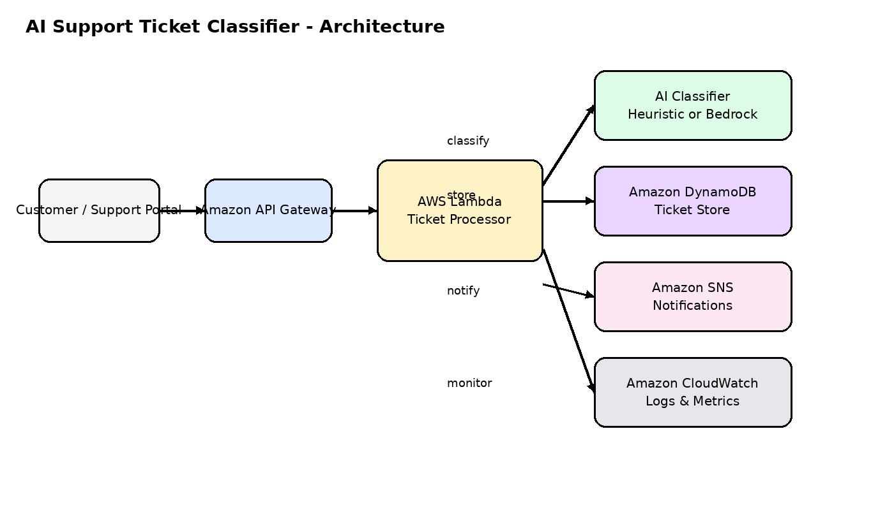

# AI Support Ticket Classifier

A GitHub-ready, serverless AI project that solves a real business problem: **manual support ticket triage**.

This system receives a customer support ticket, classifies it with AI, assigns a priority, suggests a response, stores the result, and publishes a notification for downstream teams.

## Business problem

Support teams often waste time manually reading and routing tickets. That creates:

- slow first-response times
- inconsistent categorisation
- poor escalation of urgent issues
- higher operating cost

This project reduces that overhead with an AI-assisted workflow.

## What the solution does

When a ticket is submitted, the system:

1. Accepts the request through **API Gateway**
2. Triggers **AWS Lambda**
3. Uses an AI classifier to determine:
   - category
   - priority
   - assigned team
   - suggested response
4. Stores the ticket in **DynamoDB**
5. Publishes an event to **SNS**
6. Exposes structured JSON for dashboards or downstream automation

## Architecture



Source: [`architecture/architecture-diagram.mmd`](architecture/architecture-diagram.mmd)

## Features

- AI-based support ticket classification
- Priority scoring
- Suggested customer response
- Team routing
- DynamoDB persistence
- SNS notifications
- Structured logs for CloudWatch
- Local test mode for demo and portfolio use
- Terraform for infrastructure provisioning

## Example request

```json
{
  "message": "I was charged twice for my subscription and need a refund."
}
```

## Example response

```json
{
  "ticket_id": "4f1a19fd-cb3a-4e35-8ee8-7f86cb5b321f",
  "category": "Billing",
  "priority": "High",
  "team": "Finance",
  "confidence": 0.95,
  "suggested_response": "Thanks for contacting support. We are sorry about the duplicate charge. Your billing case has been prioritised and sent to our finance team for review.",
  "model_source": "heuristic"
}
```

## Repository structure

```text
ai-ticket-classifier/
├── README.md
├── .gitignore
├── requirements.txt
├── architecture/
│   ├── architecture-diagram.png
│   └── architecture-diagram.mmd
├── data/
│   └── sample_tickets.json
├── infrastructure/
│   └── terraform/
│       ├── apigateway.tf
│       ├── dynamodb.tf
│       ├── iam.tf
│       ├── lambda.tf
│       ├── main.tf
│       ├── outputs.tf
│       ├── sns.tf
│       ├── variables.tf
│       └── versions.tf
├── lambda/
│   ├── src/
│   │   ├── ai_classifier.py
│   │   ├── app.py
│   │   ├── config.py
│   │   ├── models.py
│   │   └── storage.py
│   └── tests/
│       └── test_classifier.py
└── scripts/
    └── local_test.py
```

## How the AI works

The application supports two classifier modes:

1. **Heuristic mode**  
   Default demo mode. Works immediately without external AI credentials. Good for portfolio demos and local testing.

2. **Bedrock mode**  
   If you provide an AWS Bedrock model ID and enable the relevant permissions, the Lambda uses an LLM for classification.

The Lambda will automatically fall back to heuristic mode if no Bedrock model is configured.

## Tech stack

- Python 3.12
- AWS Lambda
- Amazon API Gateway
- Amazon DynamoDB
- Amazon SNS
- Terraform
- AWS Bedrock (optional AI mode)

## Local setup

### 1. Create a virtual environment

```bash
python -m venv .venv
source .venv/bin/activate
pip install -r requirements.txt
```

### 2. Run the local test script

```bash
python scripts/local_test.py
```

### 3. Run unit tests

```bash
pytest
```

## Deploy with Terraform

### 1. Package Lambda

From the repo root:

```bash
cd lambda/src
zip -r ../../infrastructure/terraform/lambda.zip .
cd ../../
```

### 2. Initialize Terraform

```bash
cd infrastructure/terraform
terraform init
```

### 3. Review the plan

```bash
terraform plan -var="aws_region=eu-west-2" -var="project_name=ai-ticket-classifier"
```

### 4. Apply

```bash
terraform apply -var="aws_region=eu-west-2" -var="project_name=ai-ticket-classifier"
```

## Required Terraform variables

You can use defaults for a quick demo, but these are the key ones:

- `project_name`
- `aws_region`
- `environment`
- `notification_email`
- `bedrock_model_id` (optional)

Example:

```bash
terraform apply   -var="project_name=ai-ticket-classifier"   -var="environment=dev"   -var="aws_region=eu-west-2"   -var="notification_email=your-email@example.com"
```

## API usage after deployment

Use the Terraform output `api_invoke_url`.

Example:

```bash
curl -X POST "${API_URL}/tickets"   -H "Content-Type: application/json"   -d '{"message":"My account is locked and password reset is not working."}'
```

## Data model

DynamoDB item structure:

- `ticket_id` - unique identifier
- `created_at` - ISO timestamp
- `original_message` - raw customer message
- `category` - AI category
- `priority` - AI priority
- `team` - routed team
- `confidence` - model confidence score
- `suggested_response` - generated response
- `model_source` - `heuristic` or `bedrock`

## Example categories

- Billing
- Technical Support
- Account Access
- Feature Request
- Complaint
- General Inquiry

## Monitoring and operations

Recommended operational controls:

- CloudWatch logs for Lambda
- CloudWatch alarms for Lambda errors and throttles
- DLQ or retry strategy for SNS subscribers
- Reserved concurrency for Lambda if needed
- API Gateway throttling and usage plans for public exposure

## Security notes

- Principle of least privilege in IAM
- No secrets hard-coded in code
- Optional Bedrock access controlled via IAM
- DynamoDB and SNS ARNs injected via environment variables

## Portfolio talking points

This project demonstrates:

- applied AI for business process automation
- AWS serverless architecture
- Infrastructure as Code with Terraform
- production-minded logging and error handling
- product thinking around a measurable business problem

## Suggested GitHub repo description

> Serverless AI support ticket classifier using AWS Lambda, API Gateway, DynamoDB, SNS, Terraform, and optional Bedrock integration.

## Suggested future improvements

- Add a Streamlit or React dashboard
- Add sentiment analysis
- Add agent feedback loop for continual prompt improvement
- Add event-driven analytics with EventBridge
- Add authentication and rate limiting
- Add CI/CD with GitHub Actions

## License

MIT
